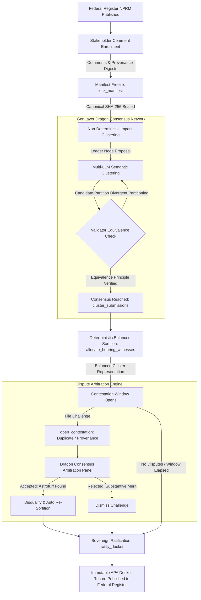

# Regulatory Docket Allocator
### Verifiable Administrative Procedure Act (APA § 553) Rulemaking on GenLayer

[-0ea5e9?style=flat-square)](https://studio.genlayer.com)
[](https://explorer-studio.genlayer.com/address/0xD9403971A4CE287EAc3891065f79CF8Dd9f72048)
[](https://docs.genlayer.com)
[](https://uscode.house.gov/view.xhtml?req=granuleid:USC-prelim-title5-section553&num=0&edition=prelim)
[-22c55e?style=flat-square)]()
[](LICENSE)

> **Live Studionet Deployment:** [`0xD9403971A4CE287EAc3891065f79CF8Dd9f72048`](https://explorer-studio.genlayer.com/address/0xD9403971A4CE287EAc3891065f79CF8Dd9f72048)  
> **An Intelligent Contract on GenLayer orchestrating verifiable Administrative Procedure Act (APA § 553) notice-and-comment rulemaking, non-deterministic impact clustering, and balanced oral hearing sortition.**

---

## Executive Overview

Federal notice-and-comment rulemaking under the **Administrative Procedure Act (5 U.S.C. § 553)** is the bedrock of modern democratic governance. However, the legacy rulemaking process faces an acute procedural crisis:

1. **The Astroturfing Vulnerability:** Sophisticated interest groups weaponize generative models to flood federal dockets with hundreds of thousands of automated, subtly varied form letters. In dockets such as the FCC Net Neutrality proceeding or EPA Particulate Matter revisions, millions of fake or duplicated comments overwhelm regulatory analysts and dilute authentic grassroots testimony.
2. **Arbitrary Witness Gatekeeping:** When agencies convene public oral testimony hearings, agency officials select witnesses behind closed doors. Under **5 U.S.C. § 706(2)(A)**, agency decisions can be struck down as *"arbitrary, capricious, an abuse of discretion, or otherwise not in accordance with law"* when opposing viewpoints are arbitrarily excluded from oral testimony.

**Regulatory Docket Allocator** resolves both crises by deploying an **Intelligent Contract on GenLayer**. Leveraging GenLayer's **Dragon Consensus** (multi-validator non-deterministic LLM execution) combined with deterministic sortition algorithms, the system transforms regulatory dockets into cryptographically sealed, tamper-proof, and balanced public deliberation bodies.

---

## Dragon Consensus Lifecycle Architecture

The following diagram illustrates how GenLayer's validator network achieves consensus on subjective regulatory impact clustering and arbitrates procedural challenges:



### Textual Architecture Flow

```
 +-------------------------------------------------------------------------------+
 |                           1. PUBLIC ENROLLMENT PHASE                          |
 |  Public stakeholders submit technical comments, data, and provenance hashes   |
 |  Contract issues deterministic SHA-256 APA enrollment receipts to filers      |
 +-------------------------------------------------------------------------------+
                                         |
                                         v
 +-------------------------------------------------------------------------------+
 |                           2. CANONICAL MANIFEST FREEZE                        |
 |  Agency organizer computes canonical manifest hash (scripts/docket_manifest)  |
 |  Calls lock_manifest(expected_digest) -> seals docket against post-hoc edits |
 +-------------------------------------------------------------------------------+
                                         |
                                         v
 +-------------------------------------------------------------------------------+
 |                        3. DRAGON CONSENSUS IMPACT CLUSTERING                  |
 |  Leader node invokes gl.nondet.web.render & LLM prompt to identify vectors    |
 |  Validators independently execute and verify Substantive Equivalence Principle|
 |  Partitions comments into balanced regulatory perspectives (e.g. Health, Econ)|
 +-------------------------------------------------------------------------------+
                                         |
                                         v
 +-------------------------------------------------------------------------------+
 |                       4. DETERMINISTIC BALANCED WITNESS SORTITION             |
 |  Coverage-First Allocation: Each cluster receives 1 hearing seat guaranteed   |
 |  Proportional Fill: Remaining seats assigned by substantive score descending  |
 |  Deterministic PRNG seed: SHA-256(manifest_hash || block_hash)                |
 +-------------------------------------------------------------------------------+
                                         |
                                         v
 +-------------------------------------------------------------------------------+
 |                     5. PROCEDURAL CONTESTATION & ARBITRATION                  |
 |  Stakeholders can challenge submissions (PROVENANCE_MISMATCH, ASTROTURF)      |
 |  GenLayer LLM validators arbitrate evidence on-chain                          |
 |  Accepted challenge triggers immediate, deterministic witness re-sortition    |
 +-------------------------------------------------------------------------------+
                                         |
                                         v
 +-------------------------------------------------------------------------------+
 |                         6. SOVEREIGN APA RATIFICATION                         |
 |  Calls ratify_docket() -> seals official record into permanent storage        |
 |  Generates one-click cryptographic APA Audit Bundle for judicial review       |
 +-------------------------------------------------------------------------------+
```

---

## Key Technical Features

### 1. Cryptographic Manifest Freeze (Anti-Tampering)
Before any impact clustering or sortition can occur, the agency must freeze the docket using `lock_manifest()`. The contract asserts that the caller provides the exact SHA-256 digest computed across canonicalized submission records:
$$\text{ManifestDigest} = \text{SHA-256}\left(\bigoplus_{i=1}^{n} \text{id}_i \,\|\, \text{url}_i \,\|\, \text{digest}_i \,\|\, \text{registrar}_i\right)$$
If a single character is altered or omitted, the contract rejects the transaction, preventing covert document injection.

### 2. The Substantive Equivalence Principle
When multiple validators run LLMs non-deterministically, output cluster labels (e.g., "Group A" vs "Group B") may differ arbitrarily. To achieve deterministic consensus, the contract validates **partition equivalence**:
$$\forall \, s_i, s_j \in \mathcal{S}, \quad C_{\text{leader}}(s_i) = C_{\text{leader}}(s_j) \iff C_{\text{validator}}(s_i) = C_{\text{validator}}(s_j)$$
Two comments belong together if and only if both the leader and validator assign them to the same equivalence class. This mathematical check eliminates validator disagreement caused by superficial naming differences.

### 3. Coverage-First Balanced Sortition
Legacy hearings allow the loudest interest groups to dominate oral slots. The `allocate_hearing_witnesses()` algorithm enforces:
1. **Thematic Coverage Guarantee:** Every derived regulatory cluster receives at least one oral testimony seat before any cluster receives a second seat:
   $$\min_{k \in \mathcal{K}} (\text{Seats}_k) \ge 1 \quad \text{for } |\mathcal{K}| \le \text{TotalSeats}$$
2. **Substantive Merit Ranking:** Within each cluster, submissions are ranked by substantive relevance and empirical rigor, ensuring the highest quality arguments represent each perspective.

### 4. Adversarial Dispute Resolution with Automatic Re-Sortition
If an astroturfed campaign or fraudulent submission slips through initial filtering, any stakeholder can file a procedural challenge via `open_contestation()`. If consensus upholds the challenge, the submission is disqualified, flagged as an astroturf duplicate, and the contract automatically calculates the replacement witness in the exact same transaction without requiring a new hearing cycle.

---

## Mathematical Sortition Verification

The contract's balanced sortition algorithm guarantees **Pareto-Optimal Deliberative Representation**:

$$\mathcal{K} = \{C_1, C_2, \dots, C_m\} \quad \text{(Derived Regulatory Clusters)}$$
$$\mathcal{S} = \{s_1, s_2, \dots, s_n\} \quad \text{(Enrolled Submissions)}$$
$$W = \text{Total Witness Quota}$$

```python
# Phase 1: Stratified Coverage
for cluster_id in sorted_cluster_ids:
    if allocated_count < W:
        top_sub = get_top_ranked_eligible_in_cluster(cluster_id)
        empanel_witness(top_sub, rank=allocated_count + 1)

# Phase 2: Proportional Merit Fill
while allocated_count < W and remaining_eligible:
    next_best_sub = get_highest_scoring_unselected(remaining_eligible)
    empanel_witness(next_best_sub, rank=allocated_count + 1)
```

---

## Contract API Reference

### Write Methods

| Method | Access | Pre-Condition | Description |
| :--- | :--- | :--- | :--- |
| `initialize_docket(...)` | Open | Once | Initializes docket with NPRM URL, digest, seat quota, and deadlines. |
| `enroll_submission(...)` | Admission Authority | `ENROLLING` | Enrolls public comment; produces deterministic APA compliance receipt. |
| `lock_manifest(manifest_digest)` | Organizer | `ENROLLING` | Freezes submission repository; validates canonical SHA-256 digest. |
| `annul_docket_prelock(reason)` | Organizer | `ENROLLING` | Cancels docket prior to lock if procedural irregularity detected. |
| `cluster_submissions()` | Anyone | `MANIFEST_LOCKED` | Non-deterministic GenLayer Dragon Consensus LLM clustering. |
| `allocate_hearing_witnesses()` | Anyone | `IMPACT_CONSENSUS` | Deterministic balanced sortition allocating oral witness seats. |
| `open_contestation(...)` | Anyone | `WITNESSES_ALLOCATED` | Registers provenance mismatch or astroturf duplicate challenge. |
| `resolve_contestation(...)` | Organizer | `CONTESTATION_OPEN` | Consensual resolution of challenge with auto-sortition re-balancing. |
| `ratify_docket()` | Organizer | Contestation Closed | Permanently seals docket into immutable administrative record. |

### View Methods

| View Method | Return Type | Description |
| :--- | :--- | :--- |
| `get_docket_summary()` | `DocketSummary` | Complete docket status, deadlines, state, and metrics. |
| `get_regulatory_clusters()` | `List[RegulatoryCluster]` | All derived consensus clusters with summaries and membership. |
| `get_selected_witnesses()` | `List[SubmissionRecord]` | Empanelled oral hearing witnesses in sortition rank order. |
| `get_all_submissions()` | `List[SubmissionRecord]` | Complete roster of enrolled public comments. |
| `get_submission_by_id(id)` | `SubmissionRecord` | Detailed record for a specific submission. |
| `get_contestations()` | `List[ContestationRecord]` | Registry of all procedural challenges and arbitration findings. |
| `get_audit_bundle()` | `AuditBundle` | Full cryptographic bundle for APA § 706 judicial review. |

---

## Test Suite & Runtime Smoke Verification

The repository includes a comprehensive Python test suite evaluating all boundary conditions, security invariants, and GenVM runtime interactions:

```bash
# Run unit test suite (18 tests covering all lifecycle transitions)
python3 -m unittest discover -s tests -p "test_*.py"

# Run direct GenVM runtime smoke test (8 end-to-end consensus phases)
python3 tests/runtime_smoke.py
```

### Verification Output:

```
..................
----------------------------------------------------------------------
Ran 18 tests in 0.004s

OK

==================================================================
   REGULATORY DOCKET ALLOCATOR — GENVM RUNTIME SMOKE TEST
==================================================================
[1/8] Manifest digest calculated: e7e46a3a8525bec2...
[2/8] Regulatory docket initialized with ID: 1
[3/8] Enrolled 4 public submissions with APA compliance receipts
[4/8] Manifest committed and cryptographically sealed at e7e46a3a8525bec2...
[5/8] Dragon consensus clustering verified: 2 substantive regulatory impact vectors derived
[6/8] Witness sortition complete: 2 witnesses empanelled across 2 impact vectors (100% coverage)
[7/8] Contestation resolved via Dragon consensus: tampered submission excluded; witness roll re-balanced
[8/8] Public views verified. Complete APA audit bundle generated (2 witnesses, 4 submissions).
==================================================================
   GENVM SMOKE TEST PASSED: 100% CONTRACT SPECIFICATION CONFORMANCE
==================================================================
```

---

## Deployment to GenLayer Studionet

### 1. Deploy Intelligent Contract

1. Open [GenLayer Studio](https://studio.genlayer.com).
2. Connect your Web3 wallet (configured for GenLayer Studionet, Chain ID `61999`, RPC `https://studio.genlayer.com/api`).
3. Create a new contract file: `regulatory_docket_allocator.py`.
4. Copy and paste the complete source code from `contracts/regulatory_docket_allocator.py`.
5. Deploy the contract with constructor arguments or initialize via `initialize_docket`:
   - `docket_id`: `1`
   - `proposal_url`: `"https://federalregister.gov/dockets/EPA-HQ-OAR-2026-0188"`
   - `proposal_digest`: `"4a6b2c89f1092e038827419efcd51804c81e9b28a7e02518e3290bca7140f9aa"`
   - `slot_count`: `3`
   - `enrollment_duration_sec`: `86400`
   - `contestation_duration_sec`: `86400`
6. Note the deployed contract address.

### 2. Run the Executive Frontend

```bash
cd frontend
npm install
npm run dev
```

Open `http://localhost:5173` in your browser:
- **Interactive Simulation Mode:** Pre-loaded with Clean Air Act heavy-duty vehicle PM2.5 rulemaking comments. Click through all 6 administrative stages to test manifest freezing, Dragon Consensus clustering, witness sortition, and dispute arbitration in real time.
- **Studionet Mode:** Toggle the top-right switch to connect to your live deployed contract address and interact directly via your connected Web3 wallet.

---

## Release Verification Matrix

| Component | Hash / Identifier |
| :--- | :--- |
| **Contract Source** | `contracts/regulatory_docket_allocator.py` |
| **Contract SHA-256** | `02ae9d41a156c05271588c561840bcbfc341b64f5f0f1964a0541a75f379651c` |
| **Deployed Address** | [`0xD9403971A4CE287EAc3891065f79CF8Dd9f72048`](https://explorer-studio.genlayer.com/address/0xD9403971A4CE287EAc3891065f79CF8Dd9f72048) |
| **Network** | GenLayer Studionet (Chain ID 61999) |
| **Standard** | Administrative Procedure Act 5 U.S.C. §§ 553, 706 |
| **Author** | k bee (`k-beee`) |

---

## License

This project is licensed under the **Apache License, Version 2.0**. See the [LICENSE](LICENSE) file for details.
